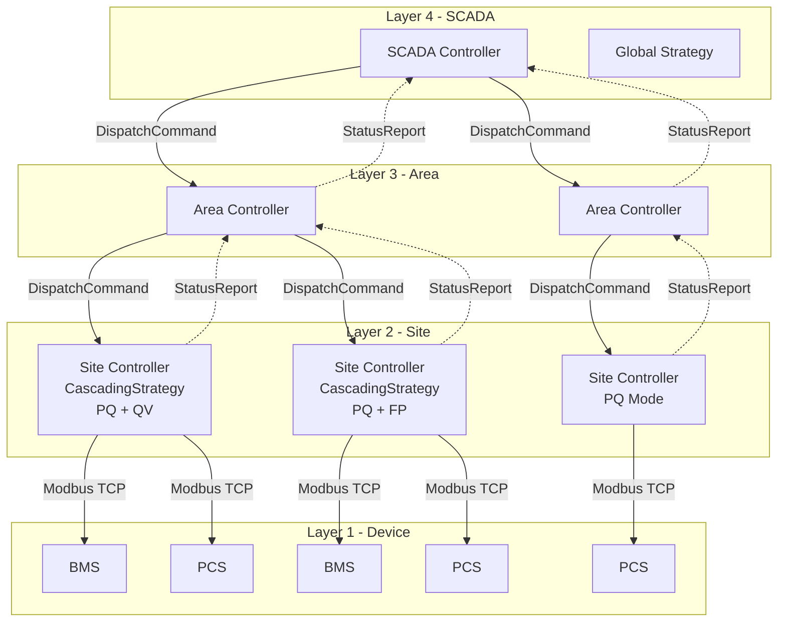

# Hierarchical Control Architecture

## Overview

csp_lib 支援 SCADA → Area → Site → Device 四層階層控制架構，透過 Protocol-based 介面抽象實現多站點分散式控制。

## Architecture Diagram



## Core Protocols

### SubExecutorAgent (Layer 6 - Integration)

遠端子執行器代理協定，定義上層對下層的統一操控介面。

```python
from csp_lib.integration.hierarchical import SubExecutorAgent

@runtime_checkable
class SubExecutorAgent(Protocol):
    @property
    def site_id(self) -> str: ...
    async def dispatch(self, command: DispatchCommand) -> None: ...
    async def get_status(self) -> ExecutorStatus: ...
    async def push_override(self, mode_name: str) -> None: ...
    async def pop_override(self, mode_name: str) -> None: ...
    async def health_check(self) -> bool: ...
```

**Layer Placement**: Layer 6 (Integration) -- depends on Layer 4 (Command, StrategyContext), depended by Layer 7/8 implementations.

### TransportAdapter (Layer 6 - Integration)

傳輸抽象協定，統一 Redis / gRPC / HTTP 等傳輸技術。

```python
from csp_lib.integration.hierarchical import TransportAdapter

@runtime_checkable
class TransportAdapter(Protocol):
    async def connect(self) -> None: ...
    async def disconnect(self) -> None: ...
    async def publish_command(self, command: DispatchCommand) -> None: ...
    async def subscribe_status(self, callback) -> None: ...
    async def health_check(self) -> bool: ...
```

**Layer Placement**: Layer 6 (Integration) -- abstract interface, concrete implementations in Layer 7 (Redis) / Layer 8 (gRPC).

## Data Structures

### DispatchCommand

上層向下層下發的調度命令封包。

```python
from csp_lib.integration.hierarchical import DispatchCommand

cmd = DispatchCommand(
    source_site_id="scada_01",
    target_site_id="site_bms",
    command=Command(p_target=500.0, q_target=100.0),
    priority=DispatchPriority.NORMAL,
    metadata={"correlation_id": "abc-123"},
)

# Serialization
data = cmd.to_dict()
restored = DispatchCommand.from_dict(data)
```

### StatusReport / ExecutorStatus

子站點向上層回報的狀態資訊。

```python
from csp_lib.integration.hierarchical import StatusReport, ExecutorStatus

report = StatusReport(
    site_id="site_bms",
    status=ExecutorStatus(
        strategy_name="cascading(pq+qv)",
        last_command=Command(p_target=600.0, q_target=250.0),
        active_overrides=(),
        base_modes=("pq", "qv"),
        is_running=True,
        device_count=3,
        healthy_device_count=3,
    ),
    metrics={"soc": 75.0, "voltage": 378.5},
)
```

## Extension Points

既有擴展點支援階層控制的對應關係：

| Extension Point | Location | Hierarchical Use |
|-----------------|----------|------------------|
| `StrategyExecutor.set_context_provider()` | L4 | 注入遠端狀態來源 |
| `StrategyExecutor.set_on_command()` | L4 | 注入遠端指令發送 |
| `ExecutionMode.TRIGGERED` | L4 | 上層觸發子站執行 |
| `ModeManager.push_override()` | L4 | 上層注入覆蓋模式 |
| `StrategyContext.extra` | L4 | 傳遞階層元資料 |
| `DeviceStateProvider` Protocol | L5 | 多層狀態聚合 |
| `VirtualContextBuilder` | L5 | 虛擬設備狀態建構 |

## CascadingStrategy in Hierarchical Context

CascadingStrategy 的 delta-based clamping 機制適用於 Site 層的多策略共存：

```
SCADA -> DispatchCommand(P=800kW) -> Site
Site CascadingStrategy:
  Layer 1 (PQ): P=800kW, Q=0
  Layer 2 (QV): P=800kW, Q=? (voltage-dependent)
  Capacity: S_max=1000kVA
  -> QV delta clamped to fit remaining capacity
```

跨站協調由 SubExecutorAgent 處理，而非 CascadingStrategy 嵌套。

## gRPC Service Definition

`.proto` 定義位於 `csp_lib/grpc/control.proto`，包含：

- **ControlDispatchService**: SCADA/Area 層呼叫，Site 層實作
  - `Dispatch()`: 下發調度命令
  - `PushOverride()` / `PopOverride()`: 模式覆蓋
  - `GetStatus()`: 查詢狀態
  - `HealthCheck()`: 健康檢查

- **StatusReportService**: Site 層推送，SCADA/Area 層訂閱
  - `ReportStatus()`: 單次狀態回報
  - `SubscribeStatus()`: 串流狀態訂閱

## Dependency Direction

```
Layer 8 (gRPC impl)     depends on -> Layer 6 (Protocols)
Layer 7 (Redis impl)    depends on -> Layer 6 (Protocols)
Layer 6 (Protocols)     depends on -> Layer 4 (Command, Strategy, Context)
Layer 4 (Controller)    no change
```

所有新增模組遵循 bottom-up 依賴方向，不引入反向依賴。

## Module Structure

```
csp_lib/integration/hierarchical/
    __init__.py         # Public exports
    agent.py            # SubExecutorAgent Protocol
    transport.py        # TransportAdapter Protocol + DispatchCommand
    status.py           # ExecutorStatus + StatusReport

csp_lib/grpc/
    __init__.py         # Module marker
    control.proto       # gRPC service definitions
```

## Security Considerations

階層控制的安全設計要點（詳見 Phase 1 安全評估報告）：

1. **認證**: 所有跨站命令需 HMAC-SHA256 簽名
2. **授權**: Override 操作需 RBAC 控制
3. **驗證**: Command 數值範圍驗證
4. **審計**: 所有操作需追溯來源站點
5. **保鮮**: 狀態資料需時間戳驗證

## Future Work

- Redis-backed `SubExecutorAgent` 實作 (`csp_lib/redis/hierarchical/`)
- gRPC-backed `SubExecutorAgent` 實作 (`csp_lib/grpc/`)
- `csp_lib[grpc]` optional dependency group
- 認證/授權中間件
- 多層 override 衝突解決策略
